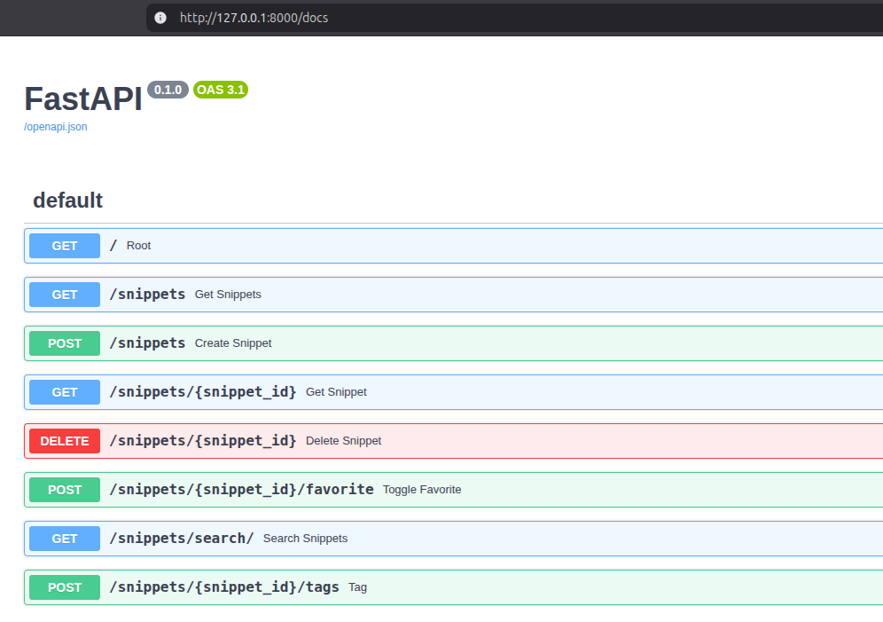

# Snipster

Snipster is a code snippet management system. It lets you...

- Add new code snippets with metadata.
- Search, list, favorite, and tag your snippets.
- Access snippets via CLI, API, and a graphical UI.


## Installation

Requirements:

- Python 3.13+
- [uv](https://docs.astral.sh/uv/getting-started/installation/)

### Get Code

```bash
git clone https://github.com/kishanpatel789/snipster.git
cd snipster
```

### Configure App

Use the template to create a `.env` file. Populate the .env file with a connection string to a database. For sqlite, you may use something like `DATABASE_URL=sqlite:///snipster.sqlite`.

```bash
cp .env.template .env
```

The Flask frontend requires a `config.json` file. Create one using the template provided.

For the [SECRET_KEY](https://flask.palletsprojects.com/en/stable/config/#SECRET_KEY) parameter, you can run a quick command like `python -c 'import secrets; print(secrets.token_hex())'`.

```bash
cd src/snipster/gui/app
cp config.json.template config.json
```

### Create Virtual Environment
Then create the virtual environment by running `uv sync`.

## Usage

Each interface of the app can be accessed using a `uv run` command. See below for specific details.

### CLI with Typer

```bash
$ uv run snipster --help

 Usage: snipster [OPTIONS] COMMAND [ARGS]...

╭─ Options ─────────────────────────────────────────────────────────────────────────────╮
│ --install-completion          Install completion for the current shell.               │
│ --show-completion             Show completion for the current shell, to copy it or    │
│                               customize the installation.                             │
│ --help                        Show this message and exit.                             │
╰───────────────────────────────────────────────────────────────────────────────────────╯
╭─ Commands ────────────────────────────────────────────────────────────────────────────╮
│ add               Add a code snippet.                                                 │
│ list              List all code snippets.                                             │
│ get               Get a code snippet by its ID.                                       │
│ delete            Delete a code snippet by its ID.                                    │
│ search            Search for code snippets by title, code, description, tag, or       │
│                   language.                                                           │
│ toggle-favorite   Toggle favorite status of a code snippet by its ID.                 │
│ tag               Add or remove tags from a code snippet.                             │
╰───────────────────────────────────────────────────────────────────────────────────────╯
```

### API with FastAPI

```bash
uv run fastapi dev src/snipster/api.py
```

The API can be reached at `http://127.0.0.1:8000`. Access the Swagger docs at `http://127.0.0.1:8000/docs`



### GUI with Flask

The graphical user interface depends on a backend FastAPI app. Make sure FastAPI is running before starting the Flask app (see section above).

Start a dev server of the Flask app by running this command:

```bash
uv run flask --app src/snipster/gui/wsgi.py run --debug
```

Access the UI at `http://127.0.0.1:5000`


## Architecture

The Snipster app is built around a core logic in python surrounded by different interfaces (CLI, API, GUI). The backend can be any database compatible with SQLAlchemy. The user-facing CLI and API interact with the core logic, and the Flask UI interacts with the API.


## Contributing

Pull requests are welcome. For major changes, please open an issue first to discuss what you would like to change.

Please make sure to update tests as appropriate.

## License

[MIT](https://choosealicense.com/licenses/mit/)
